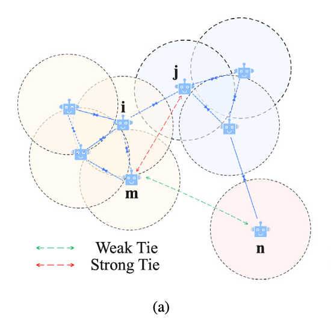
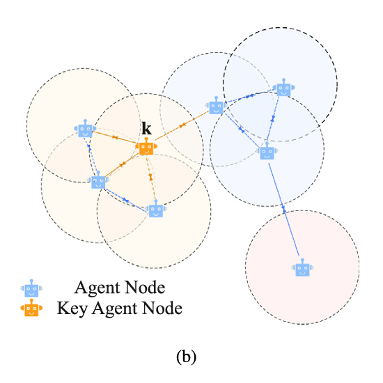
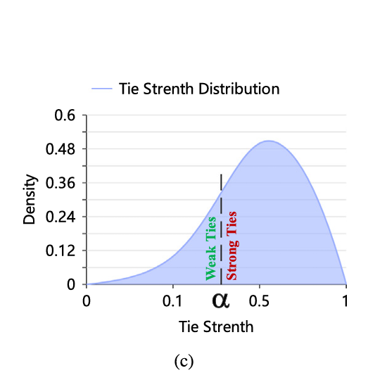
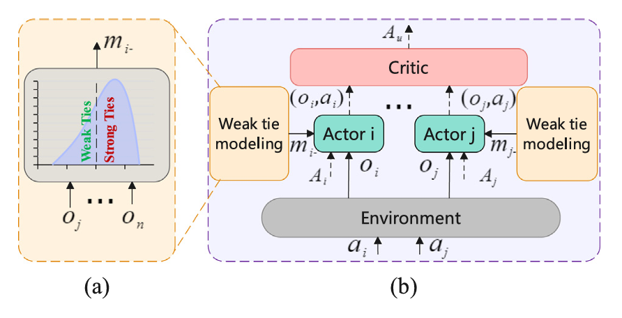

# 3.1 分散式部分可观测马尔可夫决策过程 (DEC-POMDP)

在本文中，我们将多智能体任务场景视为 DEC-POMDP，它由元组 $\langle N, S, \vec{A}, T, \vec{R}, \vec{O}, Z, \gamma \rangle$ 组成。

其中：

- $N$ 表示环境中智能体的数量
- $S$ 表示环境的状态集合
- $\vec{A} = [A_1, \ldots, A_N]$ 表示联合动作集合 $\vec{a}$
- $A_i$ 表示智能体 $i$ 可以使用的局部动作集合 $a_i$
- $T(s' \mid s, \vec{a}) : S \times \vec{A} \times S \to [0,1]$ 表示状态转移函数
- $\vec{R} = [R_1, \ldots, R_N] : S \times \vec{A} \to \mathbb{R}^N$ 表示联合奖励函数
- $\vec{O} = [O_1, \ldots, O_N]$ 表示由联合观测函数 $Z : S \times \vec{A} \to \vec{O}$ 控制的观测集合 $\vec{o}$
- $\gamma \in [0,1]$ 表示折扣因子

对于给定的环境状态 $s$，每个智能体 $i$ 基于其观测历史 $o_i$ 采取动作 $a_i$，并与环境交互以获得新的环境状态 $s'$ 和奖励 $r_i$。

智能体通过学习策略 $\pi_i : O_i \times A_i \to [0,1]$ 来最大化期望 $\mathbb{E}[G_i]$，其中 $G_i$ 表示由公式定义的折扣奖励：

$$G_i = \sum_{t=0}^{L} \gamma^t r_i^t$$

其中 $L$ 表示时间序列长度。

# 3.2 多智能体近端策略优化 (MAPPO)

基于 MAPPO 的特性（这是一种 CTDE 方法），我们的方法旨在更好地解决 MAPPO 的局限性，从而提高交互数据的质量。我们选择了 MAPPO 方法进行演示。本节简要介绍多智能体强化学习中的 MAPPO 方法。

在在线学习策略中，梯度目标价值函数为 $V^{\pi}(s^0) = \mathbb{E}[\sum_{t \geq 0} \gamma^t r_t]$，其中 $\gamma \in [0,1]$。策略 $\pi$ 的梯度为：

(1)
$$\nabla V^{\pi}(s^0) = E[\sum_{t \geq 0} \gamma^t \nabla \log \pi(a^t | s^t) A^{\pi}(a^t, s^t)]$$

其中 $A^{\pi}(s^t, a^t) = Q^{\pi}(s^t, a^t) - V^{\pi}(s^t)$ 是策略 $\pi$ 的优势函数 [33,34]，$Q^{\pi}(s^t, a^t) = r^t + \gamma V^{\pi}(s^{t+1})$ 表示状态-动作价值函数。策略梯度（PG）通过梯度提升改进策略 $\pi$，使其更接近具有更大策略优势值的动作。

为了提高 PG 的样本效率，信赖域策略优化（TRPO）[35] 旨在最大化目标函数 $V^{\pi}(s^0)$，同时受信赖域约束的限制，该约束通过 Kullback-Leibler 散度（KL 散度）强制旧策略和新策略之间的距离由阈值 $\delta$ 限定，以满足要求。表达式为：

(2)
$$J^{TRPO} = E_{a^t, s^t \sim \pi^{old}}[\frac{\pi(a^t | s^t)}{\pi^{old}(a^t | s^t)} A^{\pi^{old}}(s^t, a^t)]$$

其中 $\frac{\pi(a^t | s^t)}{\pi^{old}(a^t | s^t)}$ 是重要性采样权重，对应的 KL 散度约束为：

(3)
$$E_{s \sim \rho^{\pi^{old}}}[D_{KL}(\pi_{\theta_{old}}(. | s) \| \pi_{\theta}(. | s))] \leq \delta$$

其中 $\rho^{\pi^{old}}$ 采用策略 $\pi^{old}$ 的折扣状态采样状态分布。然而，在大规模神经网络中，计算 KL 散度会导致优化目标函数的困难。因此，近端策略优化（PPO）使用近似目标函数 [36]，计算方式如下：

(4)
$$r = \frac{\pi(a^t | s^t)}{\pi^{old}(a^t | s^t)}$$

(5)
$$\eta^{PPO} = E_{a^t, s^t \sim \pi^{old}}[\min(r A^{old}(s, a), \text{clip}(r, 1 - \epsilon, 1 + \epsilon) A^{\pi^{old}}(s^t, a^t))]$$

clip 函数将比率 $r$ 裁剪在范围 $[1 - \epsilon, 1 + \epsilon]$ 内，以近似 KL 散度约束。

此外，在多智能体环境中，MAPPO 方法对每个智能体 $i$ 的目标函数由以下公式给出：

(6)
$$r_i = \frac{\pi_i(a_i | o_i)}{\pi_i^{old}(a_i | o_i)}$$

(7)
$$\eta^{MAPPO} = \frac{1}{N} \sum_{i}^{N} E_{\vec{a}^t, s^t \sim \pi^{old}}[\min(r_i A^{old}, \text{clip}(r_i, 1 - \epsilon, 1 + \epsilon) A^{\pi^{old}})]$$

$$= \frac{1}{N} \sum_{i}^{N} E_{\vec{a}^t, s^t \sim \pi^{old}}[f(r(\theta_i)), A^{\pi^{old}}(s, a)]$$

其中 $f(r(\theta_i)), A^{\pi^{old}}(s, a) = \min(r_i A^{old}, \text{clip}(r_i, 1 - \epsilon, 1 + \epsilon) A^{\pi^{old}})$。

# 3.3 智能体间的联系

在部分可观测环境中，智能体能够直接观测到的环境状态仅限于其视野范围内。如果不了解视野外队友和敌人的信息，就很难做出最优决策。CTDE（集中训练分散执行）方法是解决部分可观测马尔可夫环境决策问题的主流方法，这类方法需要共享全局队友状态。然而，在多智能体环境中，随着智能体数量的增加，简单地共享全局队友信息很可能导致信息维度爆炸和通信压力增大的问题。为了提高信息交互质量和训练效率，我们开发了一个基于弱联系理论的多智能体训练框架。在本节中，我们将描述如何将这一理论与多智能体强化学习（MARL）中的图建模方法相融合。

在智能体与环境交互的过程中，可以获得每个智能体 $i$ 的位置信息。在一定程度上，智能体之间的相对位置反映了交互价值。距离较近的智能体之间的交互价值较高。相反，当智能体彼此距离较远时，交互价值较低。这种简单的推理并不能完全表征智能体之间的交互性；例如，在战斗中，远离队友的侦察兵的观测状态往往能提供更有价值的信息。为了解决这个问题，在本研究中，我们首先根据环境的相关约束条件，以智能体为节点建立信息交互图网络，如图1(a)所示。

在图中，蓝色机器人代表智能体，我们将其作为一个节点。以智能体为中心的虚线圆表示最有可能发生交互的范围（默认值为观测范围），具有相同颜色交互范围的智能体位于同一子图中。建立交互图的规则如下：

**定义1（智能体间的边）**：当两个智能体 $i$ 和 $j$ 在彼此的观测范围内时，它们之间存在一条边 $w_{i,j}$。

**定义2（子组间的边）**：当建立的交互图中存在未连接的子图时，两个子图之间最有可能在距离最近的两个智能体之间发生交互。

如图1(a)和(b)所示，对于已建立的多智能体交互图，智能体之间的联系强度和交互中的主导智能体定义如下：

**定义3（智能体间的强联系）**：如果智能体 $i$ 和 $j$ 之间的联系强度大于阈值 $\alpha \in [0,1]$，则这两个智能体之间的联系为强联系。

**定义4（智能体间的弱联系）**：如果智能体 $m$ 和 $n$ 之间的联系强度小于阈值 $\alpha$，则这两个智能体之间的联系为弱联系。

**定义5（主导智能体）**：如果智能体 $k$ 在当前交互图中与其他智能体的边数最多，则智能体 $k$ 是该交互网络中的主导智能体（关键智能体），记为 $a_{key}$。主导智能体的默认数量为1。

在两个子图中，智能体 $i$ 和 $j$ 之间最有可能发生交互，因此 $i$ 和 $j$ 之间存在边。智能体 $j$ 和 $m$ 之间的最短路径中只有两条边；$j$ 和 $m$ 之间的联系强度为强。智能体 $m$ 和 $n$ 的最短路径中有四条边；$m$ 和 $n$ 之间的联系强度为弱。如图1(b)所示，智能体 $i$ 在当前交互图中与其他智能体的边数最多（节点 $i$ 的度最大），即四条边，因此它是当前交互图的主导智能体。

如图1(c)所示，我们计算每一步智能体之间的联系分布，并使用所得分布的下 $\alpha$ 分位数作为联系强度阈值，默认情况下 $\alpha = 0.3$。

根据文献[13]，智能体 $i$ 和 $j$ 之间的联系强度计算如公式(8)所示：

$$
s_{strength} = 1/(D_i + D_j + W_{i,j} - 2)
$$

其中，$W_{i,j}$ 是智能体 $i$ 和 $j$ 之间最短路径中的边数，$D_i$ 和 $D_j$ 分别是智能体 $i$ 和 $j$ 的度数。具体算法如算法1所示。

---

